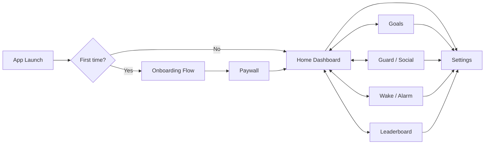
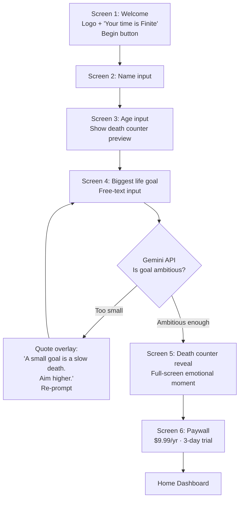
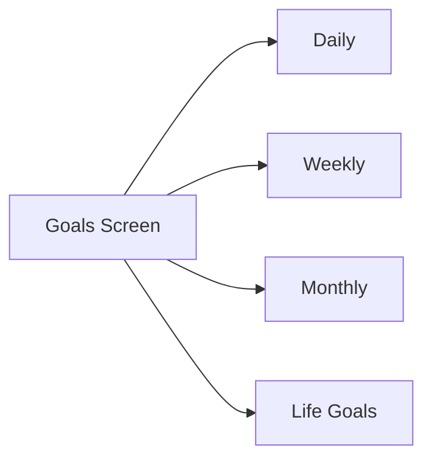

# Finite — Wireframe & Flow Spec for Designer

**Project:** Finite — Stoic life-countdown app
**Purpose of this doc:** Confirm screen structure, navigation flow, and content hierarchy with the designer **before** high-fidelity design work begins.
**What this is NOT:** Final visuals. The screenshots in this doc are *current coded state* — they show structure & content only. The designer's job is to elevate the visual treatment while keeping the flow & hierarchy intact.

---

## 1. Brand recap (locked — do not change)

| Token | Value |
|---|---|
| Background | `#0A0A0A` (void) |
| Surface / cards | `#111111` |
| Accent (the only accent) | `#C9A227` (gold) |
| Text primary | `#F5F5F5` |
| Text muted | `#888888` |
| Danger (over-limit only) | `#FF4444` |
| Counter font | Space Mono / JetBrains Mono |
| Headings & body | Inter |
| Stoic quotes only | Lora italic / Newsreader |

→ Dark mode always. No gradients. No shadows. No glassmorphism. No illustrations.
→ Vibe target: luxury watch × stoic philosophy book × terminal UI.
→ Vibe to AVOID: Notion / Todoist / generic productivity app.

---

## 2. Top-level app map

**5 bottom tabs:** Home · Goals · Guard · Wake · Rank
**Settings:** accessed via gear icon top-right of Home (not a tab)

---

## 3. Onboarding flow (REVISED — this is the new spec)

> **Important:** This replaces the older 6-screen onboarding. Onboarding is now **shorter and smarter**. We only ask for the minimum, and we use AI to validate the user's biggest life goal in real time.

### What's removed from old onboarding
- ❌ Multiple goal selection screen → goals are now configured **inside** the dashboard later
- ❌ Alarm time setup → configured inside Wake tab later
- ❌ Social media app limits → configured inside Guard tab later

### What stays
- ✅ Welcome → Name → Age → Life Goal → Death counter reveal → Paywall
- ✅ Paywall placement is **non-negotiable**: must appear *after* the death counter reveal (emotional peak = highest conversion)

### Designer notes for onboarding
- Each screen is full-bleed, single-purpose, one input max
- Big breathing room — this is a philosophical app, not a form
- The death counter reveal screen (O5) is the most important screen in the entire app — it should feel like a punch
- The "goal too small" overlay should feel stoic, not patronizing — like a wise teacher disagreeing, not an error message

---

## 4. Main screens — current state + delta notes

### 4.1 Home Dashboard (Tab: Home)

**Hierarchy (top → bottom):**
1. Top bar — share icon (left), settings gear (right)
2. **HERO: Death counter** — "TIME REMAINING" label + huge gold number + "days left to live" + HRS/MIN/SEC breakdown box
3. Current time + date
4. 4 stat tiles: Goals (X/3) · Social (Xm) · Streak (X) · Points (X)
5. Stoic quote card (gold left border, italic serif font)
6. "This Week" mini bar — M T W T F S S dots + total points
7. Bottom tab bar (5 tabs)

**Designer notes:**
- The death counter is the soul of the app. It must dominate. Don't shrink it.
- The 4 stat tiles need to feel like watch sub-dials, not productivity widgets
- The quote card is the only place serif italic appears — protect that
- Tab bar: gold = active, muted gray = inactive

---

### 4.2 Goals (Tab: Goals)

**Current state in screenshot:** Shows life goals with check-in cards.

**REVISED spec — designer please redesign this screen:**

The goals screen needs **4 sections / tabs** within it (segmented control at top):

| Tab | What goes here | AI validation? |
|---|---|---|
| **Daily** | Today's checklist (resets daily, contributes to streak) | No |
| **Weekly** | Goals for this week (resets Monday) | No |
| **Monthly** | Goals for this month (resets 1st of month) | No |
| **Life Goals** | Long-term ambitions (the big ones) | **Yes — Gemini API checks ambition level on submit** |

**Behavior for Life Goals tab:**
- User taps "+" to add a life goal
- Types into a text field
- On submit, backend Gemini API analyzes ambition
- If too small → gold-bordered modal: *"This goal is too small for the time you have left. Aim higher."* + retry button
- If ambitious → goal added with subtle gold celebration

**Designer notes:**
- Each tab shows max 3 goals (enforced limit)
- Reuse the existing card style from current screenshot
- "Streak broken" red text in current screenshot is good — keep that pattern
- "Today's points: +0" footer stays
- Add the segmented tab control at top — this is the biggest delta

---

### 4.3 Guard / Time Thieves (Tab: Guard)

**Hierarchy:**
1. Title: "Time thieves" + subtitle "Your social media costs in remaining life"
2. List of tracked apps (Instagram, YouTube, TikTok, X, Reddit, Snapchat) — empty state shown when none configured
3. Weekly summary card: "This week: X.X hours lost" + "X.XX% of your remaining life. Forever."

**Designer notes:**
- This screen tracks social media usage **across both web and mobile** (the mobile app reads UsageStatsManager on Android, AppState lifecycle + self-report on iOS, the Chrome extension reports web usage to the same backend)
- The framing "% of your remaining life. Forever." is the psychological weapon — make it feel heavy
- Each tracked app should be a card showing: app icon + name + today's minutes + this week's minutes + tiny progress bar against limit (gold under, red over)
- Empty state: prompt user to "Set your limits" — opens a modal **inside this screen** (not in Settings — see §5 below)
- Per-app config (limit minutes/day) is **inline here**, not in Settings

---

### 4.4 Wake / Alarm (Tab: Wake)

**Hierarchy:**
1. "WAKE UP" label
2. Alarm time (huge, white, monospace): `05:00`
3. "Tomorrow morning" subtitle
4. **Today's wake-up message card** — personalized motivational message generated daily ("You have 18,247 days left. Yesterday you wasted 2.3 hours on social media. That's 0.01% of your remaining life. Gone.")
5. Alarm sound card — sound name + "changes daily" gold label
6. Two CTAs: SET ALARM (gold filled) + EDIT TIME (gold outline)

**Behavior:**
- Time is **configurable** inline — tap EDIT TIME → time picker modal
- Sound rotates daily from a 7-sound library (stoic bell, dawn chorus, war drum, zen bowl, spartan horn, piano dawn, silent strength) — fetched from backend each night
- Wake-up message is also fetched daily (variable rewards principle from Greene)
- Push notifications also fire throughout the day (evening review, streak risk, social over-limit)

**Designer notes:**
- The wake-up message card is the second-most important content piece in the app (after the death counter) — give it weight
- Time editing is **inline here**, not in Settings

---

### 4.5 Leaderboard / Rank (Tab: Rank)

**Hierarchy:**
1. Title: "Warriors of Discipline"
2. Subtitle: "Weekly rankings — resets Monday"
3. **User's own rank card** — pinned at top, gold border, shows #rank + "You" + points + streak
4. Top 50 list — rank number + avatar circle + username + points + streak days
5. User's row in the list also gets a subtle gold tint when scrolled into view

**Behavior:**
- Resets every Monday 00:00 UTC (cron job rebuilds rankings)
- Top 3 might get tiny gold accents (medal-ish, but stoic — no emoji)
- Tap a username → optional V2: profile view (skip for V1)

**Designer notes:**
- The "You" pinned card is critical — users need to see themselves immediately
- Don't make this feel gamified-cute. Feel: ancient ranking of warriors, not Duolingo leaderboard

---

### 4.6 Settings (accessed via gear icon, NOT a tab)

**REVISED spec — designer please simplify:**

The current screenshot shows Goals & Social media limits inside Settings. **Remove those.** They're configured in their respective dashboard screens (Goals tab and Guard tab).

**Final Settings sections (simplified):**

| Section | Contents |
|---|---|
| Profile | Name, age, life expectancy (default 75) |
| Notifications | Master toggle, quiet hours, reminder frequency |
| Subscription | Current plan, manage via RevenueCat |
| About Finite | Version, Privacy Policy link, Terms link, Contact |
| Sign out | Red text at bottom |

**Removed from Settings (now lives in their tabs):**
- ❌ Goals → managed in Goals tab
- ❌ Social media limits → managed in Guard tab

**Designer notes:**
- Modal sheet from bottom (drag handle visible at top in current screenshot — keep this)
- Simple list rows, no icons needed, gold chevron on the right
- Sign out red text at bottom is good — keep it

---

## 5. Configuration philosophy (important architectural decision)

> **Settings is for the app. Each tab manages its own domain.**

This means:
- Goals are configured **in the Goals tab** (add/edit/delete)
- Social media app limits are configured **in the Guard tab** (per-app limit setting)
- Alarm time is configured **in the Wake tab** (inline edit button)
- Settings only holds: profile, notifications, subscription, about

**Why:** Users live in the dashboard tabs daily. Forcing them to dig into Settings to change a goal limit is friction. Each tab is self-contained.

---

## 6. Screens designer needs to deliver

| # | Screen | Priority | Notes |
|---|---|---|---|
| 1 | Onboarding — Welcome | P0 | Logo hero |
| 2 | Onboarding — Name | P0 | Single input |
| 3 | Onboarding — Age + counter preview | P0 | Critical moment |
| 4 | Onboarding — Life goal input | P0 | Plus the "too small" rejection state |
| 5 | Onboarding — Death counter reveal | P0 | The hero moment |
| 6 | Onboarding — Paywall | P0 | $9.99/yr + $6/6mo + 3-day trial |
| 7 | Home dashboard | P0 | The most-viewed screen |
| 8 | Goals — with 4 segmented tabs (Daily/Weekly/Monthly/Life) | P0 | New segmented control |
| 9 | Goals — Add goal modal (with AI rejection state for Life Goals) | P0 | |
| 10 | Guard — empty state | P0 | "Set your limits" prompt |
| 11 | Guard — populated with tracked apps + per-app limit modal | P0 | |
| 12 | Wake — main screen | P0 | |
| 13 | Wake — time picker modal | P0 | |
| 14 | Leaderboard | P0 | |
| 15 | Settings sheet (simplified) | P0 | |
| 16 | Share card (1080×1920 Instagram Story format) | P1 | For viral loop |

**Total: 16 screens** (was 12 — onboarding split + add-goal modal + time picker + share card)

---

## 7. Things that are LOCKED — please don't redesign

- ❌ Color palette — only the 8 tokens above. No new colors.
- ❌ Dark mode only — no light mode
- ❌ Death counter as the home screen hero — not negotiable
- ❌ Paywall position — must be after death counter reveal in onboarding
- ❌ 5-tab bottom nav — Home, Goals, Guard, Wake, Rank
- ❌ Settings as a modal sheet (not a tab)

## 8. Things designer has FREEDOM on

- ✅ Card visual treatment (radius, borders, hover/press states)
- ✅ Iconography style (line vs filled — pick one and stay consistent)
- ✅ Micro-interactions and transitions
- ✅ Empty state illustrations (text only, no graphics — but copy can be elevated)
- ✅ Typography weight/size hierarchy within the locked font families
- ✅ The death counter typographic treatment (this is the brand moment — go big)
- ✅ How the "goal too small" rejection feels — make it stoic, not error-y

---

## 9. Reference screenshots index

All screenshots in `/screens/` are **current coded state** from the React Native app. They show *content & structure*, not final visual quality. Use them as the source of truth for what data appears where.

| File | Screen |
|---|---|
| `screens/01_home_dashboard.png` | Home tab |
| `screens/02_goals.png` | Goals tab (current — needs segmented tabs added) |
| `screens/03_guard_social.png` | Guard tab (empty state) |
| `screens/04_wake_alarm.png` | Wake tab |
| `screens/05_leaderboard.png` | Rank tab |
| `screens/06_settings.png` | Settings sheet (current — needs simplification) |

---

## 10. Open questions for designer

1. Onboarding screen 5 (death counter reveal) — should this be a single static reveal or a short animation (numbers counting up to the user's remaining days)? *My preference: animated count-up over ~2s, then settles.*
2. Goals tab segmented control — top of screen or floating? *My preference: top, sticky.*
3. Leaderboard top 3 — any visual differentiation, or strictly uniform list? *My preference: subtle gold accent on #1, nothing on #2/#3.*
4. Share card — do you have a template direction in mind, or should we co-design?

---

## 11. Timeline & deliverables

- **Designer hand-off target:** end of this week (~Apr 11–12)
- **Format:** Figma file with all 16 screens + a shared component library (buttons, cards, inputs, tab bar)
- **Export:** PNG for review + Figma share link for inspect mode

---

